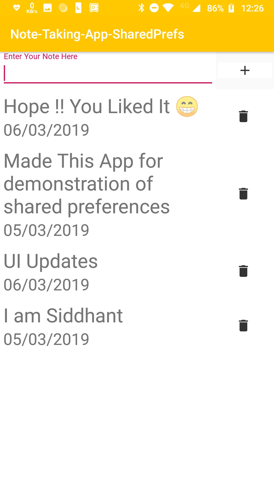

## Note-Taking-App-SharedPrefrences

### This is note taking app for the demonstration of the concept of Shared-Prefrences in android

### Components Used :- 
* Recycler View
* Text Input Edit Text (Design Support Library)
* Image Buttons

#### App-Screen

Made with :heart: by Siddhant
